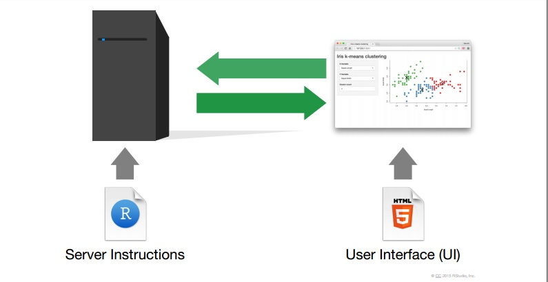

```{r setup, include=FALSE}
options(htmltools.dir.version = FALSE)
```

<br>

# Sobre mim

- IME-USP (2007-2019)

--


--


--

<br>

- Pesquisa em poluição do ar
   - Blog: [www.rpollution.com](www.rpollution.com)


--

<br>

- Curso-R


---

# Sobre o Shiny


---

# Sobre o Shiny



---

# Neste minicurso

Vamos:

- Falar como construir a interface do usuário e como conectá-la com o servidor.
- Falar o que é reatividade e como ela funciona.
- Falar como customizar do app.

Não vamos:

- Falar de tópicos mais avançados, como [modularização](https://shiny.rstudio.com/articles/#modules), [debbuging](https://shiny.rstudio.com/articles/debugging.html), [tratamento de erros](https://shiny.rstudio.com/articles/#code-quality) e [testes automatizados](https://shiny.rstudio.com/articles/#testing).

- Falar (com detalhes) sobre [Shiny server](https://www.rstudio.com/products/shiny/shiny-server/), [shinyapp.io](https://www.shinyapps.io/) e outras formas de hospedagem.

---

# Para aprender mais

- Para começar: https://shiny.rstudio.com/tutorial/

- Para se aprimorar: https://shiny.rstudio.com/articles/

- Para se inspirar: https://shiny.rstudio.com/gallery/

<br>


---

# Motivação

- Vamos construir um app do zero.

--


--

- Variáveis numéricas:
   - Peso, altura
   - HP, ataque, defesa, velocidade

--

- Variáveis categóricas:
   - tipo, região/geração

--
   
- Cor

--

- Imagens

---

# Crédito

<br>

A construção desse dashboard foi inspirada [neste post](http://jkunst.com/r/pokemon-visualize-em-all/) e [neste flexdashboard](http://jkunst.com/flexdashboard-highcharter-examples/pokemon/).

---

# Vamos ao R!

<br>
<br>


